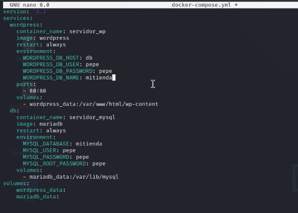
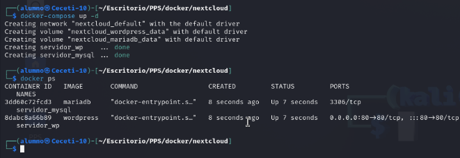
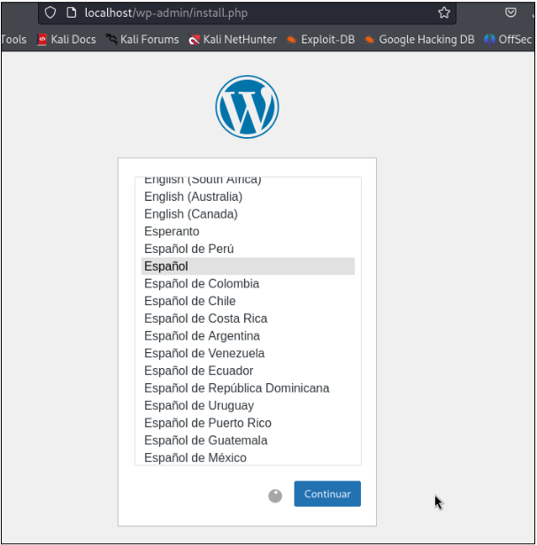

# **Sesión 4 - Escenarios multicontenedor - ejericios para entregar**

### Despliegue de Nextcloud
Vamos a desplegar la aplicación nextcloud con una base de datos (puedes elegir mariadb o PostgreSQL) utilizando la aplicación docker-compose. Puedes coger cómo modelo el fichero docker-compose.yml el que hemos estudiado para desplegar WordPress.

1. Instala docker-compose en tu ordenador.
2. Dentro de un directorio crea un fichero docker-compose.yml para realizar el despliegue de nextcloud con una base de datos. Recuerda las variables de entorno y la persistencia de información.
3. Levanta el escenario con docker-compose.
4. Muestra los contenedores con docker-compose.
5. Accede a la aplicación y comprueba que funciona.
6. Comprueba el almacenamiento que has definido y que se ha creado una nueva red de tipo bridge.
7. Borra el escenario con docker-compose.

Deberás entregar los siguientes pantallazos comprimidos en un zip o en un documento pdf:

- Pantallazo donde se vea el fichero docker-compose.yaml.

- Pantallazo donde se vea los contenedores funcionando con la instrucción docker-compose.

- Pantallazo donde se vea el acceso desde el navegador a la aplicación.

