# **Sesión 2 - Almacenamiento - Ejercicios para entregar**

### Creación y uso de volúmenes

1. Crear los siguientes volúmenes con la orden docker volume: volumen_datos y volumen_web.

  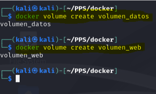

2. Una vez creados estos contenedores:
    - Arrancar un contenedor llamado c1 sobre la imagen php:7.4-apache que monte el volumen_web en la ruta /var/www/html y que sea accesible en el puerto 8080.
    - Arrancar un contenedor llamado c2 sobre la imagen mariadb que monte el volumen_datos en la ruta /var/lib/mysql y cuya contraseña de root sea admin.

3. Intenta borrar el volumen volumen_datos, para ello tendrás que parar y borrar el contenedor c2 y tras ello borrar el volumen.

4. Copia o crea un fichero index.html al contenedor c1, accede al contenedor y comprueba que se está visualizando.

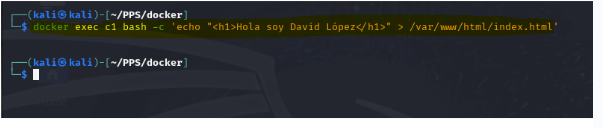

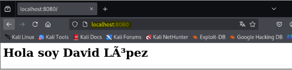

5. Borra el contenedor c1 y crea un contenedor c3 con las mismas características que c1 pero sirviendo en el puerto 808.

Deberás entregar los siguientes pantallazos comprimidos en un zip o en un documento pdf:

- Pantallazo donde se puedan ver los dos volúmenes creados.
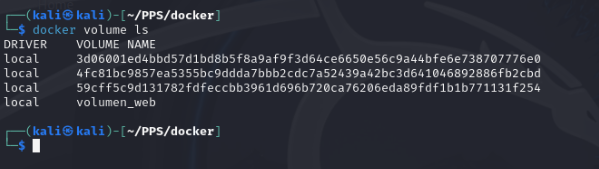
- Pantallazo con la orden correspondiente para arrancar el contenedor c1 usando el volumen_web.
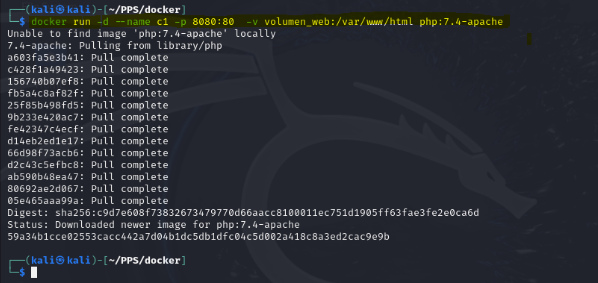

- Pantallazo con la orden correspondiente para arrancar el contenedor c2 usando el volumen_datos.
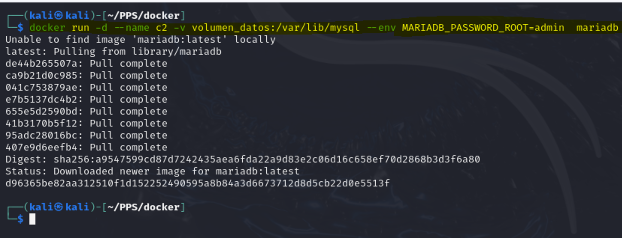

- Pantallazo donde se vea el proceso para poder borrar el volumen_datos.
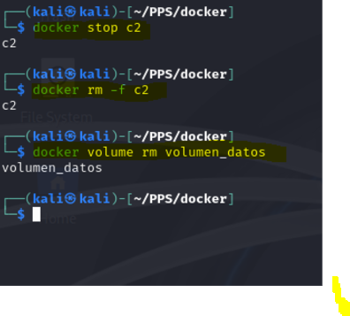
- Pantallazo donde se vea el borrado de c1 y la creación de c3.
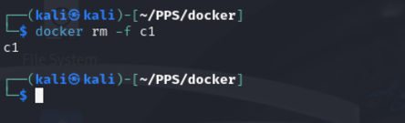
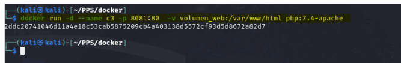
- Pantallazo donde se vea el acceso al contenedor c3.
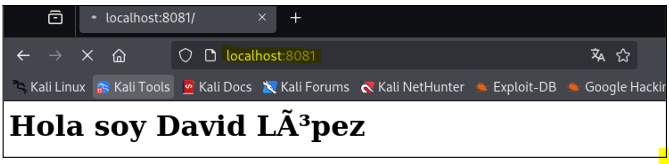

---

### Bind mount para compartir datos

1. Crea una carpeta llamada `saludo` y dentro de ella crea un fichero llamado `index.html` con el siguiente contenido (Deberás sustituir ese XXXXXx por tu nombre.):

        <h1>HOLA SOY XXXXXX</h1>

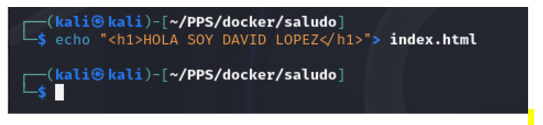

2. Una vez hecho esto arrancar dos contenedores basados en la imagen php:7.4-apache que hagan un bind mount de la carpeta `saludo` en la carpeta `/var/www/html` del contenedor. Uno de ellos vamos a acceder con el puerto 8181 y el otro con el 8282. Y su nombres serán `c1` y `c2`.
3. Modifica el contenido del fichero `~/saludo/index.html`.
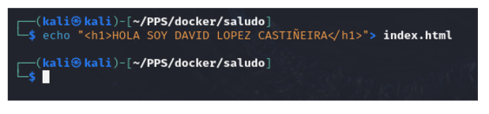
4. Comprueba que puedes seguir accediendo a los contenedores, sin necesidad de reiniciarlos.

- Pantallazo con la orden correspondiente para arrancar el contenedor c1 (puerto 8181) realizando el bind mount solicitado.
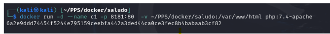
- Pantallazo con la orden correspondiente para arrancar el contenedor c2 (puerto 8282) realizando el bind mount solicitado.

- Pantallazo donde se pueda apreciar que accediendo a c1 se puede ver el contenido de index.html.
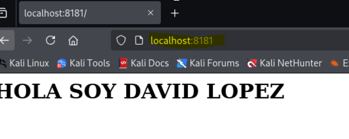
- Pantallazo donde se pueda apreciar que accediendo a c2 se puede ver el contenido de index.html.

- Otro dos pantallazos (o uno) donde se vea accediendo a los contenedores después de modificar el fichero index.html.
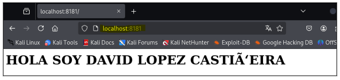
