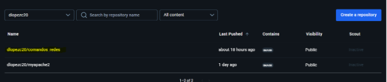
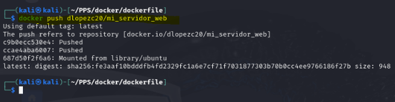

# **Sesión 5 - Creación de Imágenes - Ejercicios para entregar**

### Creación de una imagen a partir de un contenedor

1. Arranca un contenedor desde una imagen base debian o ubuntu.
2. Instala los paquetes `inetutils-ping`, `iproute2` y `dnsutils` con distintas herramientas de redes.

3. Crea una imagen a partir de este contenedor (recuerda que tienes que utilizar el nombre de tu usuario Docker Hub). La imagen se debe llamar `<tu_usuario_docker_hub>/comandos_redes`.
4. Sube la imagen a Docker Hub.

5. Descarga la imagen en otro ordenador donde tengas docker instalado, y crea un contenedor a partir de ella. (Si no tienes otro ordenador con docker instalado, borra la imagen en tu ordenador y bájala de Docker Hub).

Deberás entregar los siguientes pantallazos comprimidos en un zip o en un documento pdf:

- Pantallazo donde se vea la creación del contenedor.

- Pantallazo donde se vea el comando que crea la nueva imagen.

- Pantallazo donde se vea la imagen subida a tu cuenta de Docker Hub.

- Pantallazo donde se vea la bajada de la imagen y la creación de un nuevo contenedor.

### Creación de una imagen a partir de un Dockerfile

1. Crea una página web estática (por ejemplo busca una plantilla HTML5). O simplemente crea un index.html.
2. Crea un fichero Dockerfile que permita crear una imagen con un servidor web sirviendo la página. Puedes usar una imagen base debian o ubuntu, o una imagen que tenga ya un servicio web, como hemos visto en el apartado Ejemplo 1: Construcción de imágenes con una página estática.
3. Ejecuta el comando docker que crea la nueva imagen. La imagen se debe llamar `<tu_usuario_docker_hub>/mi_servidor_web`.
4. Conéctate a Docker Hub y sube la imagen que acabas de crear.

5. Descarga la imagen en otro ordenador donde tengas docker instalado, y crea un contenedor a partir de ella. (Si no tienes otro ordenador con docker instalado, borra la imagen en tu ordenador y bájala de Docker Hub).

Deberás entregar los siguientes pantallazos comprimidos en un zip o en un documento pdf:

- Pantallazo donde se vea el contenido del fichero Dockerfile.

- Pantallazo donde se vea el comando que crea la nueva imagen.

- Pantallazo donde se vea la imagen subida a tu cuenta de Docker Hub.

- Pantalalzo donde se vea la bajada de la imagen y la creación de un nuevo contenedor.

